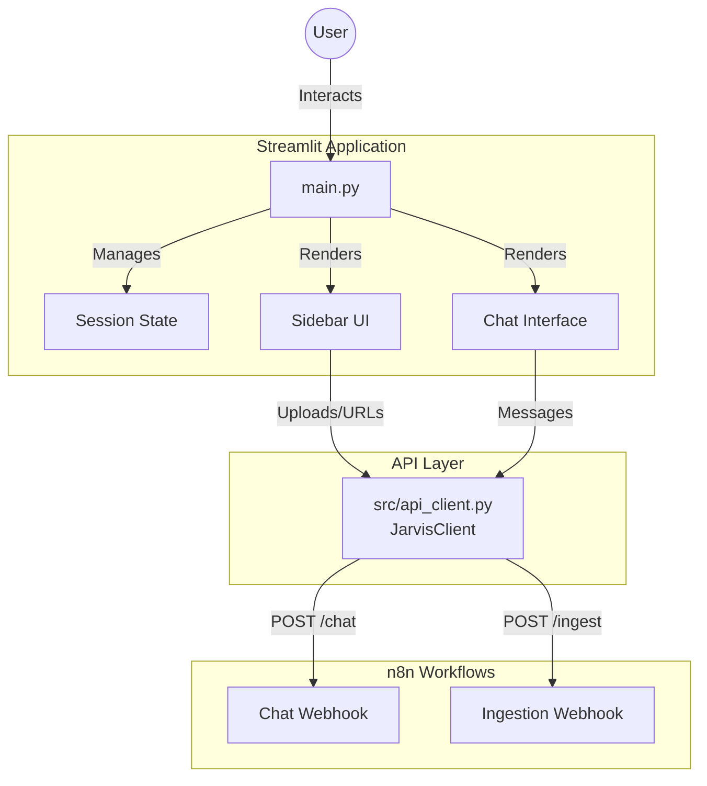

# Architecture & Data Flow

This document outlines the architecture and data flow between the Streamlit frontend (`main.py`) and the API client (`src/api_client.py`).

## Overview

The application follows a client-server pattern where the Streamlit app acts as the frontend interface, and `JarvisClient` serves as the bridge to external backend services (specifically **n8n** automation workflows).

## Detailed Component Analysis

### 1. Frontend (`main.py`)
- **Role**: Presentation layer and state management.
- **Key Responsibilities**:
    - Initializes the `JarvisClient`.
    - Manages Streamlit `session_state` (messages, UUIDs, UI toggles).
    - Renders the chat interface and side panel for knowledge management.
    - Captures user input (text, file uploads, URLs).

### 2. API Client (`src/api_client.py`)
- **Role**: Backend abstraction layer.
- **Key Responsibilities**:
    - **Configuration**: Loads webhook URLs from `st.secrets` or activates "Demo Mode" if secrets are missing.
    - **Methods**:
        - `send_message(message, session_id, optimize_for)`: Sends chat messages to the n8n chat webhook.
        - `upload_document(file_obj, optimize_for)`: Uploads files to the n8n ingestion webhook.
        - `ingest_url(url, optimize_for)`: Sends URLs to the n8n ingestion webhook for scraping.

### 3. Data Flow Scenarios

#### A. Chat Interaction
1. **User** types a message in `main.py`.
2. `main.py` appends the message to `st.session_state` and displays it.
3. `main.py` calls `client.send_message()`.
4. `JarvisClient` constructs a payload (`chatInput`, `sessionId`, `optimise_for`).
5. `JarvisClient` sends a **POST** request to the `chat_webhook_url`.
6. **n8n** processes the request and returns a response.
7. `JarvisClient` handles errors/formatting and returns the text.
8. `main.py` displays the response.

#### B. Document Ingestion
1. **User** uploads a file in the `main.py` sidebar.
2. `main.py` calls `client.upload_document()`.
3. `JarvisClient` wraps the file in a `multipart/form-data` request.
4. `JarvisClient` sends a **POST** request to the `ingest_webhook_url`.

#### C. URL Ingestion
1. **User** enters a URL in the `main.py` sidebar.
2. `main.py` calls `client.ingest_url()`.
3. `JarvisClient` constructs a JSON payload (`url`, `optimise_for`).
4. `JarvisClient` sends a **POST** request to the `ingest_webhook_url`.
